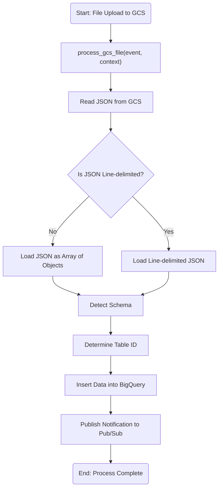
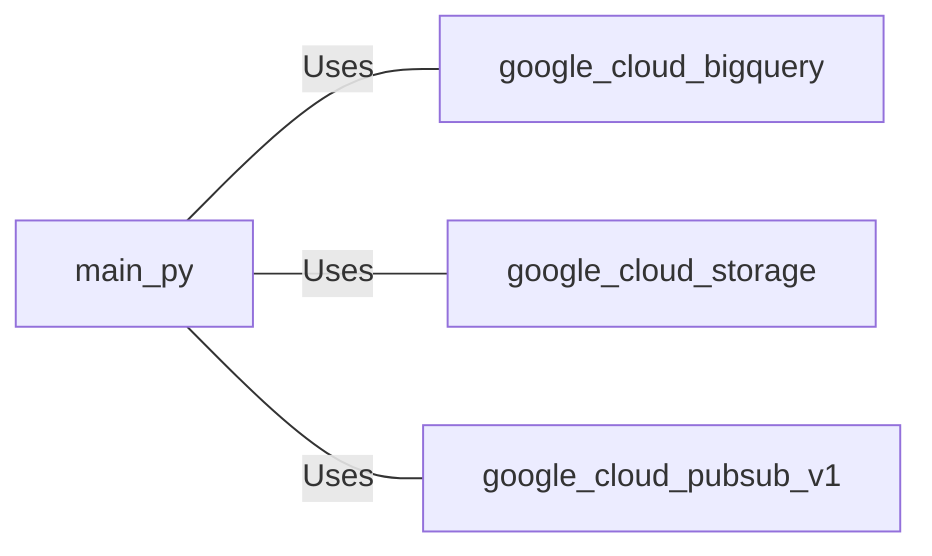

# main.py: GCS File Processing and BigQuery Integration

## Overview

This script is designed to process files uploaded to a Google Cloud Storage (GCS) bucket. It detects the schema of the JSON data, dynamically determines the appropriate BigQuery table, and inserts the data into the table. Upon successful completion, it publishes a notification to a Google Cloud Pub/Sub topic.

## Process Flow

## Insights

- The script handles both standard JSON arrays and line-delimited JSON formats.
- It dynamically creates a BigQuery table if it does not exist, using a schema derived from the JSON data.
- A unique table ID is generated using a hash of the schema to accommodate different data structures.
- Notifications of successful data processing are sent to a Pub/Sub topic, facilitating integration with other systems.

## Dependencies

- `google.cloud.bigquery`: Used for interacting with BigQuery to create tables and insert data.
- `google.cloud.storage`: Used for accessing and reading files from Google Cloud Storage.
- `google.cloud.pubsub_v1`: Used for publishing messages to a Pub/Sub topic to notify about job completion.

# take-home-test
Steps for deployment from terminal

STEP 1
git clone repo locally

STEP 2
gcloud auth login

STEP 3
gcloud config set project devoteam-interview-pav-dhillon

STEP 4
bq mk test_3

STEP 5
gcloud functions deploy process_gcs_file \
    --runtime python310 \
    --trigger-resource test-3-pd-cf \
    --trigger-event google.storage.object.finalize \
    --region us-central1 \
    --entry-point process_gcs_file

STEP 6
Upload file to GCS bucket to test
