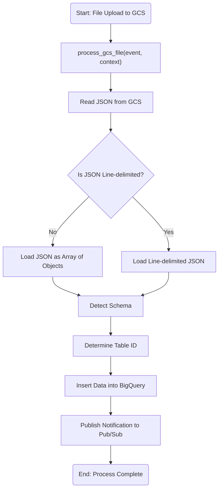
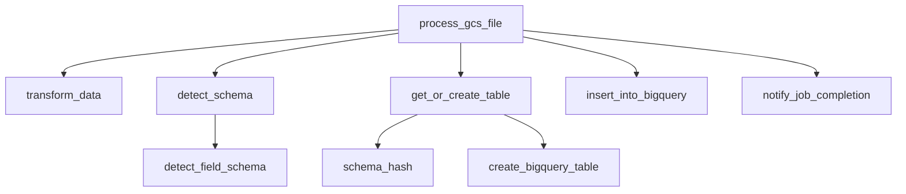
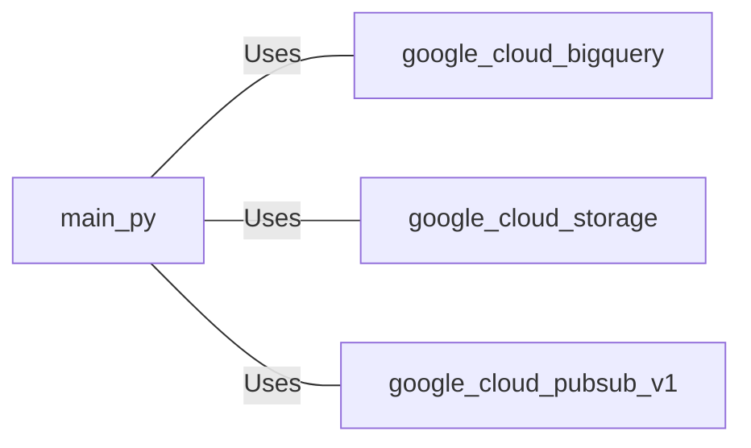
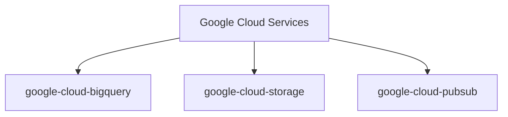
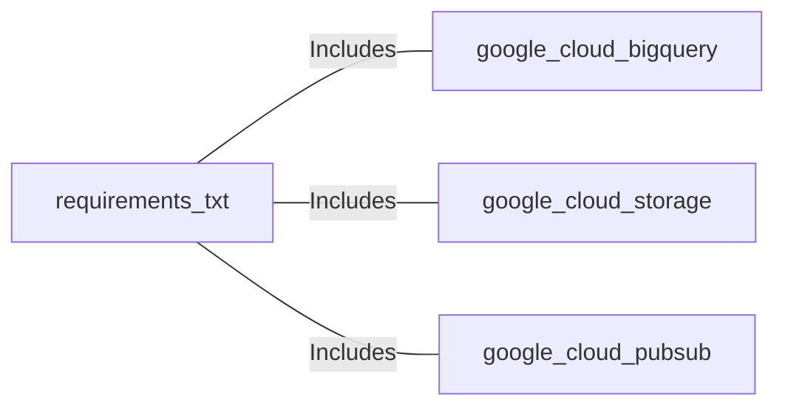

# Architecture Diagram


# main.py: GCS File Processing and BigQuery Integration

## Overview

This script is designed to process files uploaded to a Google Cloud Storage (GCS) bucket. It detects the schema of the JSON data, dynamically determines the appropriate BigQuery table, and inserts the data into the table. Upon successful completion, it publishes a notification to a Google Cloud Pub/Sub topic.

## Process Flow


# Documentation of the file main.py

## Introduction
This file, `main.py`, is designed to process files uploaded to a Google Cloud Storage (GCS) bucket. It detects the schema of the uploaded JSON file, dynamically determines the appropriate BigQuery table, inserts the data into the table, and publishes a notification to a Google Cloud Pub/Sub topic upon successful completion.

## Description
The script is triggered by changes to a GCS bucket. It processes the uploaded JSON file, detects its schema, and inserts the data into a BigQuery table. The table is dynamically determined based on the schema of the data. After successful data insertion, a notification is sent to a Pub/Sub topic to indicate job completion. The script handles both standard JSON and line-delimited JSON formats and supports nested and repeated records in the JSON data.

## Structure
The file is structured into several functions, each responsible for a specific task in the data processing pipeline. The main function, `process_gcs_file`, orchestrates the entire process, calling other helper functions to transform data, detect schema, manage BigQuery tables, insert data, and send notifications.

## Dependencies
- `google.cloud.bigquery`: For interacting with BigQuery.
- `google.cloud.storage`: For accessing and downloading files from GCS.
- `google.cloud.pubsub_v1`: For publishing messages to a Pub/Sub topic.
- `json`: For parsing JSON data.

## Imports
```python
import json
from google.cloud import bigquery
from google.cloud import storage
from google.cloud import pubsub_v1
```

## Variables
- `bucket_name`: The name of the GCS bucket where the file is stored.
- `file_name`: The name of the file in the GCS bucket.
- `dataset_id`: The ID of the BigQuery dataset.
- `base_table_id`: The base name for the BigQuery table.
- `pubsub_topic`: The name of the Pub/Sub topic for notifications.

## Methods

### `process_gcs_file(event, context)`
Triggered by a change to a GCS bucket. It processes the uploaded file, detects the schema, determines the table ID, inserts data into the table, and publishes a notification to a Pub/Sub topic.

### `transform_data(data)`
Flattens repeated records and handles nested JSON arrays to ensure compatibility with BigQuery.

### `detect_schema(data)`
Detects the BigQuery schema from JSON data by analyzing the first object in the data.

### `detect_field_schema(key, value)`
Detects the schema for a single field, including support for RECORD and repeated RECORD types.

### `get_or_create_table(dataset_id, base_table_id, schema)`
Checks if a table exists in the dataset. If it doesn't, creates it with the given schema.

### `schema_hash(schema)`
Generates a simple hash from the schema to create a unique table ID for different schemas.

### `create_bigquery_table(dataset_id, table_id, schema)`
Creates a BigQuery table with the detected schema.

### `insert_into_bigquery(dataset_id, table_id, rows)`
Inserts rows into a BigQuery table.

### `notify_job_completion(topic, file_name, table_id)`
Publishes a message to a Pub/Sub topic to notify about job completion.

## Example
To use this file, deploy it as a Cloud Function in Google Cloud Platform, and configure it to trigger on changes to a specific GCS bucket. Ensure that the necessary permissions are set for accessing GCS, BigQuery, and Pub/Sub.

## Dependency Diagram


## Notes
- Ensure that the Google Cloud SDK is installed and configured with the necessary permissions to access GCS, BigQuery, and Pub/Sub.
- The script assumes that the JSON file contains an array of objects or is line-delimited.

## Vulnerabilities
- The script does not handle all possible JSON formats and assumes a specific structure.
- Error handling is basic and could be improved to provide more detailed feedback.
- The script assumes that the first object in the JSON data is representative of the entire dataset for schema detection.

## Dependencies



- `google.cloud.bigquery`: Used for interacting with BigQuery to create tables and insert data.
- `google.cloud.storage`: Used for accessing and reading files from Google Cloud Storage.
- `google.cloud.pubsub_v1`: Used for publishing messages to a Pub/Sub topic to notify about job completion.


# requirements.txt: Google Cloud Services Dependencies

## Overview

This document outlines the dependencies required for integrating with various Google Cloud services. These dependencies are essential for applications that interact with Google Cloud BigQuery, Google Cloud Storage, and Google Cloud Pub/Sub.

## Process Flow



## Insights

- The application relies on Google Cloud services for data storage, processing, and messaging.
- `google-cloud-bigquery` is used for data warehousing and analytics.
- `google-cloud-storage` is utilized for storing and retrieving large datasets.
- `google-cloud-pubsub` is employed for asynchronous messaging and event-driven systems.

## Dependencies



- `google-cloud-bigquery`: Provides tools for interacting with Google BigQuery, a fully-managed data warehouse.
- `google-cloud-storage`: Offers capabilities for storing and accessing data on Google Cloud Storage.
- `google-cloud-pubsub`: Facilitates message-oriented middleware for sending and receiving messages between independent applications.


# Steps for Deployment from IDE/terminal
Follow the below steps to successfully deploy the above workflow to Google Cloud Platform

## STEP 1
Clone the repo locally:

```
git clone https://github.com/pavdhillon/take-home-test.git
```

## STEP 2
Authenticate to GCP via commandline:

```
gcloud auth login
```

## STEP 3
Set the project you wish to deploy in:

```
gcloud config set project devoteam-interview-pav-dhillon
```

## STEP 4
Create a BigQuery Dataset. This will be the dataset the Cloud Function deploys the tables in. 
Edit he parameter as needed - [DATASET_NAME]: The name of the dataset to create. Dataset names must be unique within a project.

```
gcloud bigquery datasets create [DATASET_NAME]
```

## STEP 5
Create a GCS bucket: 
Edit the parameters as needed - [BUCKET_NAME]: The name of the bucket. It must be unique across all GCP buckets.
--location [LOCATION]: The location where the bucket resides. Examples: US, EU, asia-south1.
--storage-class [STORAGE_CLASS]: (Optional) The type of storage class. Examples: STANDARD, NEARLINE, COLDLINE, ARCHIVE. Defaults to STANDARD.
```
gcloud storage buckets create [BUCKET_NAME] \
    --location [LOCATION] \
    --storage-class [STORAGE_CLASS]
```

## STEP 6
Create Pub/Sub Topic:
Edit the parameters as needed - Parameters [TOPIC_NAME]: The name of the topic. Topic names must follow GCP naming conventions.

```
gcloud pubsub topics create [TOPIC_NAME]
```

## STEP 7
Edit the `main.py` file to include the parameters from steps 4,5 & 6.

## STEP 8
Deploy the Cloud Function:

```
gcloud functions deploy process_gcs_file \
    --runtime python310 \
    --trigger-resource test-3-pd-cf \
    --trigger-event google.storage.object.finalize \
    --region us-central1 \
    --entry-point process_gcs_file
```

## STEP 9
Test.
In order to test the workflow, navigate to the `json_test_files` folder and upload each file to the GCS bucket. This will invoke the cloud function to create a table in BigQuery and then publish a message to Pub/Sub when the upload has completed. To also verify the steps each Cloud Function is taking, look at the logs for the Cloud Function.


